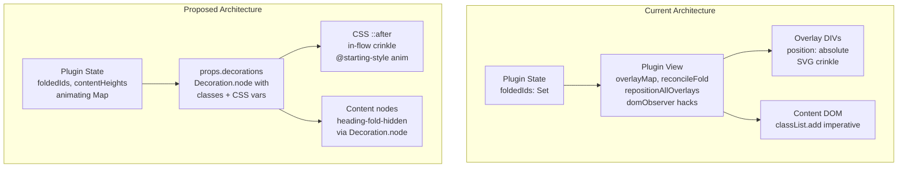
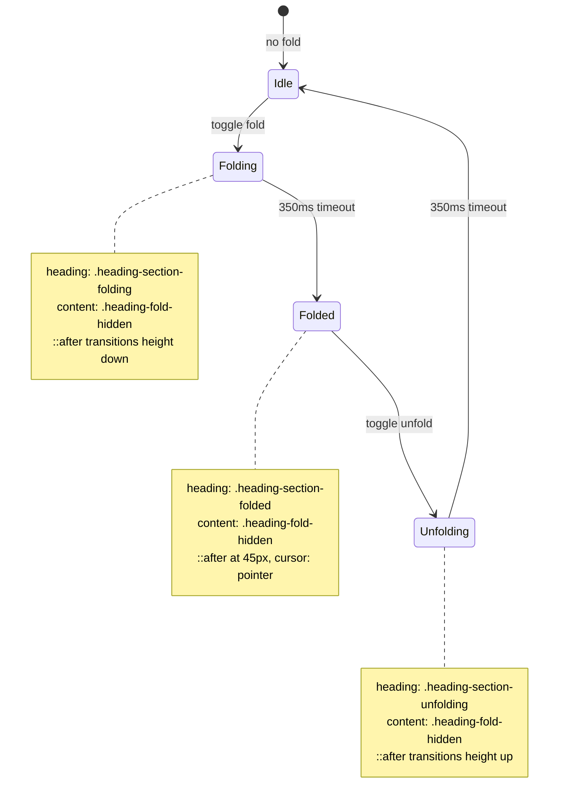

# Replace Fold Overlays with Decoration.node + CSS ::after

## Overview

Re-architect the heading fold crinkle visual from absolutely-positioned overlay divs to a CSS `::after` pseudo-element driven by `Decoration.node()`. This eliminates all overlay positioning code (~130 lines), all `domObserver.stop()/start()` hacks, and the SVG crinkle renderer. The fold/unfold behavior, persistence, TOC integration, and cursor skip are unchanged.

## Problem Statement

Absolutely-positioned overlays are fundamentally decoupled from the document flow. Every layout change (fold, unfold, edit, heading addition, resize) requires manual repositioning via `reconcileFold` and `repositionAllOverlays`, creating visible position lag and "jumping". This is an architectural limitation, not a fixable bug.

## Proposed Solution

Replace the overlay DOM elements with a CSS `::after` pseudo-element on the heading itself, applied via ProseMirror `Decoration.node()`. The `::after` is part of the heading's box model — it always occupies the correct position. Animation uses CSS `@starting-style` (Baseline 2024) to define transition starting values, eliminating the 5-phase JS choreography.

## Architecture



### State Machine



## Technical Approach

### Plugin State (expanded)

```typescript
interface HeadingFoldState {
  foldedIds: Set<string>;
  contentHeights: Map<string, number>;
  animating: Map<string, "folding" | "unfolding">;
}
```

- `foldedIds` — source of truth for "is this heading functionally folded" (TOC, cursor skip, persistence)
- `contentHeights` — measured content height per heading (needed for CSS custom property and unfold)
- `animating` — tracks which headings are mid-animation; drives decoration class selection

### Meta Types

```typescript
type HeadingFoldMeta =
  | { type: "toggle"; id: string; contentHeight?: number }
  | { type: "set"; ids: Set<string> }
  | { type: "endAnimation"; id: string };
```

### Decoration Class Selection Logic

| foldedIds | animating | Heading class | Content class |
|-----------|-----------|---------------|---------------|
| has(id) | "folding" | `heading-section-folding` + `--fold-content-height` | `heading-fold-hidden` |
| has(id) | (none) | `heading-section-folded` | `heading-fold-hidden` |
| has(id) | "unfolding" | `heading-section-unfolding` + `--fold-content-height` | `heading-fold-hidden` |
| (none) | (none) | (none) | (none) |

### CSS Animation via @starting-style

**Fold**: `::after` appears for the first time (content: '' is new). `@starting-style` defines initial height as `var(--fold-content-height)`. CSS transitions height to 45px. Crinkle gradient is `background-position: bottom` at fixed 45px — transparent space above compresses away.

**Unfold**: Class swaps from `heading-section-folded` to `heading-section-unfolding`. `::after` already exists. Normal CSS transition from `height: 45px` to `height: var(--fold-content-height)`. No `@starting-style` needed.

**Critical**: `@starting-style` nested form does NOT work with pseudo-elements. Must use standalone form:

```scss
// Standalone form — required for ::after
@starting-style {
  .heading-section-folding::after {
    height: var(--fold-content-height);
  }
}
```

### DecorationSet Strategy

Follow the `HeadingScale` pattern: full rebuild when fold state changes (meta present) or structure changes; `DecorationSet.map()` fast-path for content-only edits.

```typescript
// In state.apply(tr, prev):
apply(tr, prev) {
  const meta = tr.getMeta(headingFoldPluginKey);
  if (meta) {
    // Fold state changed — compute new foldedIds/animating, rebuild decos
    const next = applyMeta(meta, prev, tr.doc);
    return { ...next, decos: buildFoldDecorations(tr.doc, next) };
  }
  if (!tr.docChanged) return prev;
  // Content-only edit — try fast remap, else full rebuild
  if (canMapDecorations(tr, tr.before)) {
    const pruned = pruneStaleIds(prev, tr.doc);
    return { ...pruned, decos: pruned.decos.map(tr.mapping, tr.doc) };
  }
  const pruned = pruneStaleIds(prev, tr.doc);
  return { ...pruned, decos: buildFoldDecorations(tr.doc, pruned) };
}
```

Multiple `Decoration.node()` decorations on the same heading merge safely: ProseMirror concatenates `class` values (space-separated) and `style` values (semicolon-separated). HeadingScale (`--hd-size`) and HeadingDrag (`has-drag-handle`) coexist with HeadingFold decorations.

### Click Handler for Crinkle

Use `handleClickOn` plugin prop to detect clicks on the `::after` region:

```typescript
handleClickOn(view, pos, node, nodePos, event) {
  if (node.type.name !== "heading") return false;
  const headingId = node.attrs["data-toc-id"] as string;
  const state = headingFoldPluginKey.getState(view.state);
  if (!state?.foldedIds.has(headingId)) return false;
  if (state.animating.has(headingId)) return false;

  // IMPORTANT: view.nodeDOM(pos) returns null under Yjs.
  // Use view.dom.children[childIndex] instead (same as findSectionDom).
  const { headingEl } = findSectionDom(view, headingId);
  if (!headingEl) return false;
  const rect = headingEl.getBoundingClientRect();
  if (event.clientY > rect.bottom - CRINKLE_HEIGHT) {
    const { tr } = view.state;
    tr.setMeta(headingFoldPluginKey, { type: "toggle", id: headingId });
    view.dispatch(tr);
    return true;
  }
  return false;
}
```

## Implementation Tasks

### Task 1: Export `findSectionDom` and `measureContentHeight`

**File**: [heading-fold-plugin.ts](components/tiptap-node/heading-node/heading-fold-plugin.ts)

Add `export` keyword to both functions. The `toggleFold` command (in the extension) needs `findSectionDom` + `measureContentHeight` to measure content height before dispatching.

No file moves needed — the extension already imports from this module.

### Task 2: Restructure plugin state and `state.apply()`

**File**: [heading-fold-plugin.ts](components/tiptap-node/heading-node/heading-fold-plugin.ts)

Expand `HeadingFoldState` to include `contentHeights`, `animating`, and `decos: DecorationSet`.

Update `state.apply()`:

| Meta type | Action |
|-----------|--------|
| `toggle` (fold) | Add to `foldedIds` + `contentHeights` + `animating("folding")`. Rebuild decorations. |
| `toggle` (unfold) | Keep in `foldedIds`. Add to `animating("unfolding")`. Rebuild decorations. |
| `endAnimation` (fold) | Remove from `animating`. Rebuild decorations (class swaps to settled). |
| `endAnimation` (unfold) | Remove from `foldedIds` + `contentHeights` + `animating`. Rebuild decorations (all removed). |
| `set` | Replace `foldedIds`. Clear `animating`. Rebuild. |
| `docChanged` | Prune stale IDs (same as current). Map or rebuild decorations. |

Add `props.decorations()` returning the `DecorationSet` from plugin state.

### Task 3: Add `buildFoldDecorations()` function

**File**: [heading-fold-plugin.ts](components/tiptap-node/heading-node/heading-fold-plugin.ts)

New function that builds a `DecorationSet` from the current fold state. Pattern follows [heading-scale-extension.ts](components/tiptap-node/heading-node/heading-scale-extension.ts) `buildDecorations()`:

```
for each top-level heading in doc:
  check if data-toc-id is in foldedIds
  if yes:
    determine CSS class from animating map
    add Decoration.node on heading with class + style
    compute section range via computeSection
    for each content node in section:
      add Decoration.node with class: "heading-fold-hidden"
```

### Task 4: Rewrite `toggleFold` command

**File**: [heading-fold-extension.ts](components/tiptap-node/heading-node/heading-fold-extension.ts)

Import `findSectionDom` and `measureContentHeight` from the plugin module. Update the command to:

1. Check if heading is currently animating (no-op if so)
2. If folding: measure `contentHeight` from DOM, include in meta
3. If unfolding: no measurement needed (contentHeight stored in state)
4. Dispatch single transaction with all information

### Task 5: Rewrite CSS with `::after` + `@starting-style`

**File**: [heading-fold.scss](components/tiptap-node/heading-node/heading-fold.scss)

Replace current overlay styles with:

**Shared `::after` base** (DRY mixin or placeholder):

- `content: ''`, `display: block`, `border-radius`, `box-shadow`
- Crinkle gradient via `repeating-linear-gradient` replicating the 8-strip mountain/valley pattern from [crinkle-renderer.ts](components/tiptap-node/heading-node/helpers/crinkle-renderer.ts)
- `background-size: 100% 45px`, `background-position: bottom`

**`.heading-section-folding::after`**: height 45px, transition on height. `@starting-style` (standalone) sets initial height to `var(--fold-content-height)`.

**`.heading-section-folded::after`**: height 45px, no transition. `cursor: pointer`. Hover effect (enhanced box-shadow + outline).

**`.heading-section-unfolding::after`**: height `var(--fold-content-height)`, transition on height. Browser transitions naturally from 45px (previous folded state).

**`.heading-fold-hidden`**: `display: none !important` (unchanged).

**Dark mode**: `.dark` variants with inverted gradient colors (`rgba(255,255,255,...)` instead of `rgba(0,0,0,...)`).

**Delete**: `.heading-fold-overlay`, `.heading-fold-overlay--settled` rules.

### Task 6: Simplify plugin view

**File**: [heading-fold-plugin.ts](components/tiptap-node/heading-node/heading-fold-plugin.ts)

**Delete entirely**:

- `overlayMap`, `mountedParent`, `animatingIds` closure variables
- `createOverlayElement()`, `reconcileFold()`, `repositionAllOverlays()`
- `applyFold()`, `removeFold()`, `awaitTransition()`
- `applyFoldAnimated()`, `removeFoldAnimated()`
- `unmountParent()`, `mount()`
- `stopDomObserver()`, `startDomObserver()`, `ViewWithObserver` type

**Keep / adapt**:

- `view.update()`: detect `justFolded`/`justUnfolded` from state diff, schedule `setTimeout` to dispatch `endAnimation` meta. Fire `onFoldChange` callback. Call `saveFoldedIds`.
- `view.destroy()`: clear pending timeouts, set `destroyed` flag.
- Initial fold application: on first render, dispatch `{ type: "set" }` with initial IDs (no animation).

**Add**: `handleClickOn` plugin prop for crinkle click detection.

**Note on initial load**: When dispatching `{ type: "set" }` with persisted IDs, `contentHeights` is empty. This is fine — settled state (`heading-section-folded`) always uses `height: 45px`, no CSS variable needed. On first unfold, `FALLBACK_CONTENT_HEIGHT` is used (same as current behavior). Subsequent folds measure accurately.

### Task 7: Delete crinkle-renderer.ts

**File**: [crinkle-renderer.ts](components/tiptap-node/heading-node/helpers/crinkle-renderer.ts)

Delete the file. Remove the import from `heading-fold-plugin.ts`.

### Task 8: Verify coexistence and integration

After implementation, verify:

- **Decoration merging**: HeadingScale (`style: "--hd-size"`) + HeadingDrag (`class: "has-drag-handle"`) + HeadingFold (`class: "heading-section-folded"`, `style: "--fold-content-height"`) all apply to the same heading node without conflicts.
- **TOC sidebar**: `foldedIds: Set<string>` interface unchanged. `filterItemsByFoldState` works as-is.
- **Cursor skip**: `handleKeyDown` uses `foldedIds` — unchanged.
- **Persistence**: `saveFoldedIds`/`loadFoldedIds` use `Set<string>` — unchanged.
- **Initial load**: Folded sections render correctly on page load (decorations applied, no animation).
- **DecorationSet.map()** fast-path: content-only edits don't trigger full decoration rebuild.

## What Gets Deleted

| Item | Lines | Reason |
|------|-------|--------|
| `overlayMap` + all overlay management | ~50 | Replaced by `::after` |
| `reconcileFold()` | ~35 | No longer needed (decorations handle state) |
| `repositionAllOverlays()` | ~15 | No positioning needed |
| `createOverlayElement()` | ~35 | No overlays |
| `applyFold()` / `removeFold()` | ~50 | Replaced by decorations |
| `applyFoldAnimated()` / `removeFoldAnimated()` | ~110 | Replaced by CSS `@starting-style` |
| `awaitTransition()` | ~20 | No overlay transitions |
| `mount()` / `unmountParent()` | ~25 | No parent mounting |
| `stopDomObserver()` / `startDomObserver()` | ~10 | No imperative DOM |
| `crinkle-renderer.ts` | 84 | SVG replaced by CSS gradients |
| **Total deleted** | **~430** | |

## What Gets Added

| Item | Est. Lines | Purpose |
|------|------------|---------|
| `buildFoldDecorations()` | ~40 | Build DecorationSet from state |
| Expanded `state.apply()` | ~30 | Handle animating/contentHeights |
| `props.decorations()` | ~5 | Return DecorationSet |
| `handleClickOn` | ~15 | Crinkle click detection |
| Simplified `view.update()` | ~25 | Timer scheduling only |
| CSS `::after` rules | ~80 | Crinkle visual + animations |
| **Total added** | **~195** | |

**Net reduction: ~235 lines**

## Acceptance Criteria

- [ ] Fold/unfold produces smooth 350ms accordion animation
- [ ] Crinkle visual matches current look (8-strip gradient pattern)
- [ ] Crinkle is always at the correct position (no lag, no jumping)
- [ ] Multiple headings can be folded simultaneously
- [ ] Folding/unfolding one heading doesn't affect others' crinkle positions
- [ ] Click on crinkle toggles fold
- [ ] TOC chevron toggles fold
- [ ] Fold state persists across page reload
- [ ] Cursor skips over folded sections
- [ ] Dark mode crinkle renders correctly
- [ ] Hover effect on settled crinkle
- [ ] No `domObserver` hacks in the codebase
- [ ] HeadingScale and HeadingDrag decorations still work
- [ ] `crinkle-renderer.ts` is deleted

## Dependencies and Risks

**CSS `@starting-style`**: Baseline 2024 (Chrome 117+, Safari 17.5+, Firefox 129+). All browsers have supported it for 1.5+ years. If a user has an extremely old browser, the fold still works — just without the animation (instant fold/unfold). This is an acceptable graceful degradation.

**ProseMirror decoration attribute merging**: Verified in codebase — HeadingScale and HeadingDrag already apply `Decoration.node()` to the same headings. `class` and `style` merge correctly.

**SCSS `@starting-style` passthrough**: SCSS passes unrecognized at-rules through unchanged. Since `@starting-style` is a standard CSS at-rule, it compiles correctly.

**`@starting-style` trigger via class change**: ProseMirror applies `Decoration.node()` by calling `setAttribute("class", ...)` on the existing DOM element. Per the CSS spec, `@starting-style` triggers when an element (or pseudo-element) newly matches a selector due to class changes. This is confirmed by MDN examples showing `@starting-style` with dynamically-added classes.

**`view.nodeDOM()` under Yjs**: Returns null (documented in AGENTS.md). All DOM lookups use `view.dom.children[index]` via `findSectionDom()` instead.

## References

- Brainstorm: [docs/brainstorms/2026-03-11-fold-overlay-to-decoration-brainstorm.md](docs/brainstorms/2026-03-11-fold-overlay-to-decoration-brainstorm.md)
- HeadingScale decoration pattern: [heading-scale-extension.ts](components/tiptap-node/heading-node/heading-scale-extension.ts)
- HeadingDrag decoration pattern: [heading-drag-plugin.ts](components/tiptap-node/heading-node/heading-drag-plugin.ts)
- Current fold plugin: [heading-fold-plugin.ts](components/tiptap-node/heading-node/heading-fold-plugin.ts)
- Current fold CSS: [heading-fold.scss](components/tiptap-node/heading-node/heading-fold.scss)

---

## Post-Implementation: Deviations, Evolution & Final State

> Added after implementation was complete. Documents what changed from the planned approach and the final shipped architecture.

### Deviation 1: `::after` → `Decoration.widget()` for 3D Crinkle

**Planned**: CSS `::after` pseudo-element with `repeating-linear-gradient` for the crinkle visual.

**Shipped**: `Decoration.widget()` that inserts a real DOM element (`.heading-fold-crinkle`) with multiple child `div`s (4–8 strips). Each strip uses CSS 3D transforms (`perspective: 180px`, alternating `rotateX(-3deg)` / `rotateX(3deg)`) and `linear-gradient` backgrounds to create a realistic paper accordion.

**Why**: The `::after` pseudo-element cannot contain child elements, making it impossible to render individual fold strips with independent 3D transforms. The user required a "dynamic and alive" crinkle matching Docsplus's visual quality, which demanded a multi-element 3D structure.

The widget uses `key: \`fold-${tocId}\`` for DOM element reuse across decoration rebuilds, and `stopEvent` to prevent ProseMirror from processing clicks on the widget.

### Deviation 2: `@starting-style` → `@keyframes` Animations

**Planned**: CSS `@starting-style` to define transition starting values when decoration classes are first applied.

**Shipped**: CSS `@keyframes` animations (`fold-crinkle`, `unfold-crinkle`) triggered by adjacent sibling selectors (`.heading-section-folding + .heading-fold-crinkle`).

**Why**: `@starting-style` proved unreliable when ProseMirror applies decoration classes via `setAttribute`. The `@keyframes` approach is more robust — animation triggers explicitly on class application, and the CSS animation state machine (folding → folded → unfolding) maps cleanly to adjacent sibling selectors.

### Deviation 3: `handleClickOn` → Widget Click Handler

**Planned**: `handleClickOn` plugin prop with Y-coordinate check to detect clicks in the `::after` region below heading text.

**Shipped**: Direct `addEventListener("click", ...)` on the widget DOM element, dispatching a `toggle` meta transaction. The click handler reads `view.state` at click time (not creation time) to check for active animations.

**Why**: With a real DOM widget instead of a pseudo-element, a direct click listener is simpler and more reliable than coordinate-based hit testing.

### Addition 1: Nested Fold Suppression

Not in the original plan. When a parent heading is folded, its section includes child headings that may also be folded. `buildFoldDecorations` tracks an `outerFoldEnd` boundary as it iterates headings in document order. When a folded heading's position falls inside an outer fold's section, its widget and hidden-content decorations are suppressed — the parent fold already hides everything. The heading class (`heading-section-folded`) is still applied so it renders correctly when the parent later unfolds.

### Addition 2: Dynamic Strip Count

Not in the original plan. The number of fold strips in the crinkle widget is dynamic based on content height:

| Content height | Strips |
|---|---|
| < 150px | 4 (minimum) |
| 150–299px | 5 |
| 300–449px | 6 |
| 450–599px | 7 |
| 600px+ | 8 (maximum) |

More strips visually communicate more hidden content. The SCSS adapts naturally (`flex: 1`, `nth-child(odd/even)`).

### Addition 3: Hover Peek Effect

Not in the original plan. On hover, the settled crinkle smoothly expands from 45px to 58px (`$crinkle-height-peek`) over 250ms, with fold strips fanning to 5deg (from 3deg). This "peek" effect signals interactivity — like lifting a folded paper. The `transition` is scoped to `.heading-section-folded + .heading-fold-crinkle` to avoid interfering with fold/unfold `@keyframes`.

### Addition 4: `findSectionDom` Widget Filtering

Not in the original plan. Since `Decoration.widget()` inserts elements as direct children of `view.dom`, the `findSectionDom` function filters `view.dom.children` to exclude widget elements (`.heading-fold-crinkle`) before mapping document node indices to DOM elements. Without this filtering, DOM index mismatches cause incorrect content height measurements and wrong element lookups.

### Addition 5: `stopFoldWidgetEvent` Hoisted to Module Scope

The `stopEvent` function passed to `Decoration.widget()` is hoisted to a module-level constant to prevent repeated closure allocations on every `buildFoldDecorations` call.

### Acceptance Criteria Status

- [x] Fold/unfold produces smooth 350ms accordion animation
- [x] Crinkle visual matches 3D paper accordion (exceeds original gradient plan)
- [x] Crinkle is always at correct position (no lag — in-flow widget)
- [x] Multiple headings can be folded simultaneously
- [x] Folding/unfolding one heading doesn't affect others
- [x] Click on crinkle toggles fold
- [x] TOC chevron toggles fold
- [x] Fold state persists across page reload
- [x] Cursor skips over folded sections
- [x] Dark mode crinkle renders correctly
- [x] Hover effect on settled crinkle (enhanced: peek expansion)
- [x] No `domObserver` hacks in the codebase
- [x] HeadingScale and HeadingDrag decorations still work
- [x] `crinkle-renderer.ts` is deleted
- [x] Nested folds render correctly (single crinkle for outermost fold)

### Final File Inventory

| File | Lines | Role |
|------|-------|------|
| `heading-fold-plugin.ts` | ~498 | Core ProseMirror plugin: state machine, `Decoration.node()` + `Decoration.widget()`, keyboard nav, animation timers |
| `heading-fold-extension.ts` | ~85 | Tiptap extension: `toggleFold` command with content height measurement |
| `heading-fold.scss` | ~139 | 3D crinkle styles, `@keyframes` fold/unfold animations, hover peek, dark mode |
| `helpers/fold-storage.ts` | ~32 | localStorage read/write for fold state |
| `helpers/compute-section.ts` | ~45 | Section range computation (shared with drag-handle) |
| `helpers/can-map-decorations.ts` | ~46 | `DecorationSet.map()` safety check (shared) |

**Deleted**: `helpers/crinkle-renderer.ts` (SVG renderer — replaced by CSS 3D accordion)
