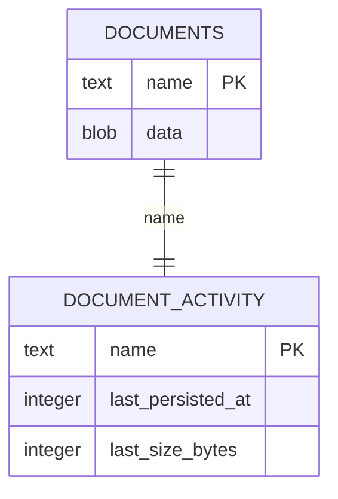

# Demo Abuse Guardrails and OWASP Baseline Hardening Implementation Plan

> **For Claude:** REQUIRED SUB-SKILL: Use superpowers:executing-plans to implement this plan task-by-task.

**Goal:** Keep TinyDocy usable as a public anonymous demo while enforcing hard limits that prevent tab/document flood abuse and unbounded SQLite growth.

**Architecture:** Ship in safe increments: HTTP-side controls first (headers + API throttling), then client UX guardrails, then migrate Hocuspocus from CLI to a custom server bootstrap for websocket/doc-creation enforcement, then retention cleanup and monitoring polish.

**Tech Stack:** Next.js 16 App Router, Bun, Hocuspocus 3, Yjs, SQLite (`better-sqlite3` + Hocuspocus SQLite extension), Playwright, Vitest.

---

## Overview

This plan implements the "A) Guardrails-First" strategy from the brainstorm:

- Anonymous write remains enabled.
- Hard server guardrails are introduced to cap abuse.
- OWASP baseline hardening is added to app and transport boundaries.

The plan treats **websocket doc creation** as the core enforcement boundary: tab cap on the client is UX-only; real creation limits must be applied when Hocuspocus persists new documents.

## Problem Statement / Motivation

- Document creation is currently implicit via websocket sync and has no server-side quota.
- Hocuspocus currently runs via CLI, which blocks use of hooks required for auth/connection/doc-limit enforcement.
- SQLite is shared between Next.js API handlers and Hocuspocus persistence; growth and contention must stay bounded.
- Public demo traffic needs predictable behavior under abuse (clear errors, fail-closed creates, observability).

## Scope and Non-Goals

### In Scope

- HTTP mutating route rate limiting (`DELETE /api/documents/[id]`) with `429` + `Retry-After`.
- Security headers for OWASP A05 baseline.
- Client-side tab cap UX (`MAX_TABS_PER_CLIENT`).
- Custom Hocuspocus server bootstrap for websocket enforcement:
  - connection cap per IP,
  - doc creation rate limit per IP,
  - total docs cap,
  - max persisted doc size.
- 30-day inactivity retention purge with protected system docs.
- Structured abuse/security logging.
- Unit + E2E coverage for new guardrails.

### Out of Scope

- Full end-user auth UI (OAuth/email).
- CAPTCHA/bot challenge (kept as escalation option).
- External observability stack migration (JSON logs stay stdout-compatible).

## Fixed Decisions (from brainstorm + spec-flow resolution)

- `MAX_TABS_PER_CLIENT = 50` (client UX cap).
- `NEXT_PUBLIC_MAX_TABS_PER_CLIENT = 50` (client-exposed tab cap source).
- `MAX_TOTAL_DOCUMENTS = 2000` (server hard cap, excluding `playground` and `global-tabs`).
- `MAX_DOC_SIZE_BYTES = 1_048_576` for persisted document payload size.
- `HTTP_MUTATION_RATE_LIMIT = 30/min/IP` (+ sustained window, configured by env).
- `WS_CONNECTION_LIMIT = 10 concurrent/IP`.
- `DOC_CREATION_RATE_LIMIT = 10/hour/IP`.
- `RETENTION_DAYS = 30` based on last persisted update.
- New-doc creation semantics are enforced at websocket load boundary: if a document name is unknown before load, creation quota checks run before SQLite persistence.
- Limit-hit behavior: fail closed for create/write, explicit structured error events, user-facing messaging.
- System docs are protected: `playground` (exact) and `global-tabs` plus `global-tabs-*` for E2E isolation. All of these are excluded from `MAX_TOTAL_DOCUMENTS`, creation rate limits, and retention purge.

## Technical Considerations

- For this scope, use `next.config.ts` `headers()` for baseline security headers; keep rate-limit logic in route handlers.
- Hocuspocus CLI does not expose full lifecycle hooks needed for robust enforcement; migrate to custom `@hocuspocus/server`.
- SQLite remains single-writer; keep writes short, set busy timeout, batch purge deletes.
- Shared IP environments (office/VPN) may see false-positive throttles; this is an accepted demo trade-off.
- Client IP extraction must be explicit behind proxies: use normalized `X-Forwarded-For`/`X-Real-IP` with documented trust assumptions. **Extraction policy:** when behind a trusted proxy (`TRUSTED_PROXY=1` or similar), use rightmost untrusted IP from `X-Forwarded-For`; reject private/reserved IPs as client identity unless in dev (`NODE_ENV=development`). Document in runbook.

## Data Model Changes

Retention and quota checks need activity metadata decoupled from Hocuspocus internal table format.

### New table: `document_activity`

- `name TEXT PRIMARY KEY`
- `last_persisted_at INTEGER NOT NULL` (unix ms)
- `last_size_bytes INTEGER NOT NULL DEFAULT 0`
- System-doc detection is derived from document name (`playground`, `global-tabs`, `global-tabs-*`), not a stored flag.

### Optional table: `abuse_events` (deferred)

- Deferred for initial rollout; use stdout JSON logs only.

## Proposed Solution

### Phase 1: HTTP hardening (low risk, immediate value)

- Add security headers in `next.config.ts`.
- Add per-IP throttling to `app/api/documents/[id]/route.ts`.
- Return `429` with `Retry-After` and stable JSON error shape.
- Add structured abuse log helper.

### Phase 2: Client tab cap UX

- Enforce max tabs at creation in `hooks/use-synced-tabs.ts`.
- Disable/add explanatory state on tab "create" UI in `components/tab-bar/tab-bar.tsx`.
- Handle remote-race scenario gracefully (message if cap reached due to concurrent updates).

### Phase 3: Hocuspocus server migration + websocket guardrails

- Replace CLI runtime with custom bootstrap script (`scripts/hocus-server.ts`).
- Add hooks for:
  - `onConnect`: connection cap per IP.
  - `onLoadDocument`: doc-count cap + creation rate policy for new docs.
  - `onStoreDocument`: max payload size check + activity upsert.
- Update `Makefile`, `ecosystem.config.cjs`, and docs to use custom server entrypoint.

### Phase 4: Retention cleanup

- Add purge script (`scripts/purge-retention.ts`) executed by cron.
- Delete stale non-system docs by `last_persisted_at < now - RETENTION_DAYS`.
- Batch deletion and vacuum strategy (`incremental_vacuum`/scheduled `VACUUM`).

### Phase 5: Monitoring and polish

- Standardize abuse/security event schema (minimal: `{ type, ip, doc?, ts_iso, reason }`; no PII beyond IP; document 7-day retention for demo).
- Validate under soak conditions.

## Implementation Tasks

### Task 1: Shared guardrail config and constants

**Files:**

- Create: `lib/security/guardrail-config.ts`
- Modify: `lib/constants.ts`
- Test: `tests/unit/lib/security/guardrail-config.test.ts`

**Steps:**

1. Add typed env parser with safe defaults for all guardrail thresholds. Enforce minimum bounds (e.g. `MAX_TOTAL_DOCUMENTS >= 1`, `HTTP_MUTATION_RATE_LIMIT >= 1`) to avoid accidental full denial.
2. Export constants for runtime use in API, Hocuspocus server, and client.
3. Add tests for invalid/empty env fallback behavior and edge cases (0, negative, NaN).
4. Run: `bun run test tests/unit/lib/security/guardrail-config.test.ts`

### Task 2: Security headers baseline in Next.js

**Files:**

- Modify: `next.config.ts`
- Test: `tests/e2e/security-headers.spec.ts`

**Steps:**

1. Add `headers()` with:
   - `X-Content-Type-Options: nosniff`
   - `Referrer-Policy: strict-origin-when-cross-origin`
   - `X-Frame-Options: DENY` (legacy fallback)
   - CSP including `connect-src 'self'` plus explicit Hocuspocus WS origin in dev/prod; `frame-ancestors 'none'` to enforce embedding restrictions.
2. Add E2E assertions for key headers on app root.
3. Run: `CI= bun run test:e2e --grep "security headers"`

### Task 3: HTTP rate limiting and abuse logging for document DELETE

**Files:**

- Create: `lib/security/rate-limit.ts`
- Create: `lib/security/abuse-log.ts`
- Modify: `app/api/documents/[id]/route.ts`
- Test: `tests/unit/lib/security/rate-limit.test.ts`
- Test: `tests/unit/api/documents-delete-rate-limit.test.ts`

**Steps:**

1. Add a simple sliding-window limiter keyed by normalized client IP.
2. Enforce limit only on DELETE mutation route.
3. Return JSON error with `429`, include `Retry-After`.
4. Emit structured log event for throttle decisions and validation failures.
5. Refactor API route to use shared doc ID validator as single source of truth.
6. Add unit tests for limit windows, header parsing, and response behavior.
7. Run: `bun run test tests/unit/lib/security/rate-limit.test.ts tests/unit/api/documents-delete-rate-limit.test.ts`

### Task 4: Client max-tab cap UX

**Files:**

- Modify: `hooks/use-synced-tabs.ts`
- Modify: `components/tab-bar/tab-bar.tsx`
- Modify: `app/page.tsx`
- Test: `tests/e2e/tabs.spec.ts`

**Steps:**

1. Block `createTab()` when current tab count reaches `MAX_TABS_PER_CLIENT`.
2. Source the client cap from `NEXT_PUBLIC_MAX_TABS_PER_CLIENT`.
3. Expose `canCreateTab` and `createTabLimitMessage` in hook API.
4. Add `canCreateTab` + `createTabLimitMessage` props to tab bar and wire from `app/page.tsx`.
5. Disable create button when blocked and show concise user-facing reason.
6. Guard Cmd/Ctrl+T path so keyboard shortcut also respects tab cap.
7. Add E2E flow: create until cap, verify disabled state/message/shortcut behavior. Set `NEXT_PUBLIC_MAX_TABS_PER_CLIENT=3` in E2E env to keep the test fast and deterministic.
8. Run: `NEXT_PUBLIC_MAX_TABS_PER_CLIENT=3 CI= bun run test:e2e --grep "tab cap"`

### Task 5: Create custom Hocuspocus server bootstrap

**Files:**

- Create: `scripts/hocus-server.ts`
- Modify: `Makefile`
- Modify: `ecosystem.config.cjs`
- Modify: `package.json`
- Modify: `tests/e2e/yjs-soak/reconnection.spec.ts` (if command assumptions change)

**Steps:**

1. Implement `@hocuspocus/server` bootstrap with SQLite extension.
2. Preserve current DB path/port behavior using env defaults (`DB_PATH` -> `db.sqlite`, `HOCUS_PORT` -> existing dev/prod values) and WAL-friendly access patterns.
3. Add rollout toggle for runtime selection (`HOCUS_USE_CUSTOM_SERVER=1|0`) so rollback does not require code edits.
4. Replace CLI startup commands in dev/prod scripts (toggle-aware).
5. Keep runtime cutover disabled until Task 6 guardrails are complete.
6. Ensure direct runtime dependencies include `@hocuspocus/server` and `@hocuspocus/extension-sqlite`.
7. Validate local start and PM2 command paths.
8. Run smoke checks:
   - `make dev`
   - `CI= bun run test:e2e --grep "reconnection"`

### Task 6: WebSocket connection + doc creation + size enforcement

**Files:**

- Modify: `scripts/hocus-server.ts`
- Create: `lib/security/doc-id-validator.ts`
- Create: `lib/security/ws-guardrails.ts`
- Create: `lib/security/client-ip.ts`
- Test: `tests/unit/lib/security/ws-guardrails.test.ts`
- Test: `tests/e2e/abuse-guards.spec.ts`

**Steps:**

1. Add `onConnect` connection cap per IP (reject with clear reason/close semantics).
2. Register guardrail hooks in order so validation/quota checks run before SQLite extension persistence hooks.
3. Validate document name in `onLoadDocument` before any quota logic: allow UUID, `playground`, `global-tabs`, or `global-tabs-*` pattern; reject any other name with explicit close reason. Create shared `lib/security/doc-id-validator.ts` (WS validator is superset of HTTP: same format rules for user docs plus system names).
4. Detect "new doc creation" in `onLoadDocument` by checking unknown document name before load and enforce global doc cap and per-IP creation rate.
5. Enforce payload size in `onStoreDocument`.
6. Exclude system docs (`playground`, `global-tabs`, `global-tabs-*`) from doc-cap enforcement.
7. Centralize client IP parsing in `lib/security/client-ip.ts` and reuse from both HTTP and WS guardrails.
8. Enforce `wss://` usage requirement in production configuration checks (`NODE_ENV=production`).
9. Add tests for reject paths (invalid doc name, cap exceeded, size exceeded) and normal paths.
10. Enable custom-server runtime toggle only after tests pass.
11. When custom runtime is enabled, update reconnection soak test to spawn the custom server path.
12. Run: `bun run test tests/unit/lib/security/ws-guardrails.test.ts`

### Task 7: Activity tracking + retention purge

**Files:**

- Create: `lib/security/activity-store.ts`
- Create: `scripts/purge-retention.ts`
- Modify: `scripts/hocus-server.ts`
- Test: `tests/unit/lib/security/activity-store.test.ts`
- Test: `tests/unit/scripts/purge-retention.test.ts`

**Steps:**

1. Add idempotent bootstrap for `document_activity` table and call it from both Hocuspocus startup and purge script startup.
2. Upsert activity on successful persist.
3. Implement purge command that:
   - skips system docs,
   - deletes from both `documents` and `document_activity` in one transaction per batch,
   - uses `BEGIN IMMEDIATE`, `busy_timeout`, and one retry on `SQLITE_BUSY`,
   - logs deletions/failures.
4. Add tests for cutoff math and protected docs.
5. Run: `bun run test tests/unit/lib/security/activity-store.test.ts tests/unit/scripts/purge-retention.test.ts`

### Task 8: Docs + ops + testing updates

**Files:**

- Modify: `README.md`
- Modify: `tests/TESTING.md`
- Modify: `docs/brainstorms/2026-03-18-demo-abuse-security-strategy-brainstorm.md` (link to plan)
- Create: `docs/operations/abuse-guardrails-runbook.md`

**Steps:**

1. Document new guardrail env vars and operational defaults.
2. Document Hocuspocus startup change (CLI -> custom server script).
3. Add runbook: incident triage for 429 spikes, doc cap reached, retention failures. Include severity levels (P1: total doc cap reached; P2: sustained 429 spike lasting over 5 min; P3: retention purge failures) and escalation thresholds.
4. Document client IP extraction rules and `TRUSTED_PROXY` behavior.
5. Validate all referenced commands.

## Acceptance Criteria

### Functional Requirements

- [ ] DELETE endpoint enforces per-IP throttling and returns `429` + `Retry-After` on exceed.
- [ ] Security headers are present on app responses and CSP allows required WS connectivity.
- [ ] Creating tabs is blocked at 50 with explicit UI feedback.
- [ ] Hocuspocus server (custom bootstrap) enforces:
  - [ ] 10 concurrent WS connections/IP
  - [ ] 10 new-doc creations/hour/IP
  - [ ] total non-system docs cap at 2,000
  - [ ] max persisted doc payload size 1 MB
- [ ] Invalid document names are rejected at websocket boundary with explicit close reason.
- [ ] Cmd/Ctrl+T does not create a tab when max-tab limit is reached.
- [ ] Production configuration enforces `wss://` for Hocuspocus endpoint.
- [ ] Retention purge removes stale non-system docs older than 30 days.

### Non-Functional Requirements

- [ ] Existing collaboration flow remains functional under normal usage.
- [ ] No hydration mismatch or invalid DOM introduced in tab UI updates.
- [ ] SQLite lock contention stays bounded (no widespread `SQLITE_BUSY` failures in tests).
- [ ] All new limits are configurable through env.

### Quality Gates

- [ ] Unit tests added for rate limiting, ws guardrails, and retention logic.
- [ ] E2E tests cover tab-cap UX and at least one abuse rejection path.
- [ ] Soak/reconnection tests pass with custom Hocuspocus server path.
- [ ] Documentation updated for runtime and operations.

## SpecFlow Gaps Closed

- System docs (`playground`, `global-tabs`) are explicitly excluded from cap/retention.
- "Doc creation" is explicitly defined as first persist of unknown document name via websocket lifecycle.
- `MAX_DOC_SIZE_BYTES` is explicitly defined against persisted payload bytes.
- `Retry-After` semantics are required for throttled HTTP responses.
- Retention is based on `last_persisted_at` and never purges system docs.

## Dependencies & Risks

### Dependencies

- Hocuspocus custom bootstrap stability in local and PM2 environments.
- Consistent client IP extraction across deployment topology.
- Test infrastructure able to exercise rejection paths deterministically.

### Risks

- **Shared-IP throttling false positives:** acceptable for demo; document and tune thresholds.
- **CSP breakage:** start with conservative policy and verify app/editor WS behavior.
- **Migration risk from CLI:** mitigate with phased release and quick rollback to CLI command.
- **Retention data races:** batch deletes and avoid deleting recently active docs.

## Rollout Plan

1. Deploy Phase 1 + 2 first (HTTP hardening + tab cap).
2. Observe logs for one cycle (throttles, errors, user friction).
3. Deploy Phase 3 with runtime toggle (`HOCUS_USE_CUSTOM_SERVER=0` => CLI, `1` => custom server) and switch to custom only after Task 6 tests pass.
4. Enable retention purge in dry-run mode first, then enforce.
5. Finalize monitoring thresholds and runbook.

## Rollback Plan

- Set `HOCUS_USE_CUSTOM_SERVER=0` and restart Hocuspocus process to return to CLI runtime immediately.
- Disable strict limits via env values if false positives are severe.
- Keep security headers enabled unless they break critical app functionality.

## Verification Commands

- `bun audit` (or equivalent; run before deploy)
- `bun run check`
- `bun run lint`
- `bun run test`
- `CI= bun run test:e2e --grep "tab cap|security headers|abuse"`
- `CI= bun run test:yjs-soak`

## OWASP Alignment (Explicit)

- **A01 Broken Access Control:** doc ID validation (HTTP + WS), creation caps.
- **A02 Cryptographic Failures:** Require `wss://` for Hocuspocus in production (NODE_ENV=production); document in runbook.
- **A03 Injection:** Prepared statements only; doc name validation at WS boundary.
- **A04 Insecure Design:** Quotas, fail-closed on limit hit.
- **A05 Security Misconfiguration:** Security headers, env-safe defaults.
- **A06 Vulnerable Components:** Add `bun audit` to Verification Commands and pre-deploy checklist.
- **A09 Security Logging:** Structured abuse events, schema, retention.
- **A10 SSRF:** Strict URI allowlist in `lib/url-utils.ts` (existing).

## References & Research

### Internal References

- `docs/brainstorms/2026-03-18-demo-abuse-security-strategy-brainstorm.md`
- `docs/plans/2026-03-16-feat-tab-sync-reorder-close-all-plan.md`
- `app/api/documents/[id]/route.ts`
- `hooks/use-synced-tabs.ts`
- `Makefile`
- `ecosystem.config.cjs`
- `next.config.ts`
- `tests/e2e/yjs-soak/reconnection.spec.ts`

### External References

- [Next.js security headers docs](https://nextjs.org/docs/advanced-features/security-headers)
- [Next.js Proxy docs](https://nextjs.org/docs/app/getting-started/proxy)
- [Hocuspocus authentication guide](https://tiptap.dev/docs/hocuspocus/guides/authentication)
- [Hocuspocus server hooks](https://tiptap.dev/docs/hocuspocus/server/hooks)
- [Hocuspocus throttle extension](https://tiptap.dev/docs/hocuspocus/server/extensions/throttle)
- [OWASP HTTP Security Headers Cheat Sheet](https://cheatsheetseries.owasp.org/cheatsheets/HTTP_Headers_Cheat_Sheet.html)
- [SQLite WAL](https://www.sqlite.org/wal.html)
- [SQLite busy_timeout pragma](https://www.sqlite.org/pragma.html#pragma_busy_timeout)
